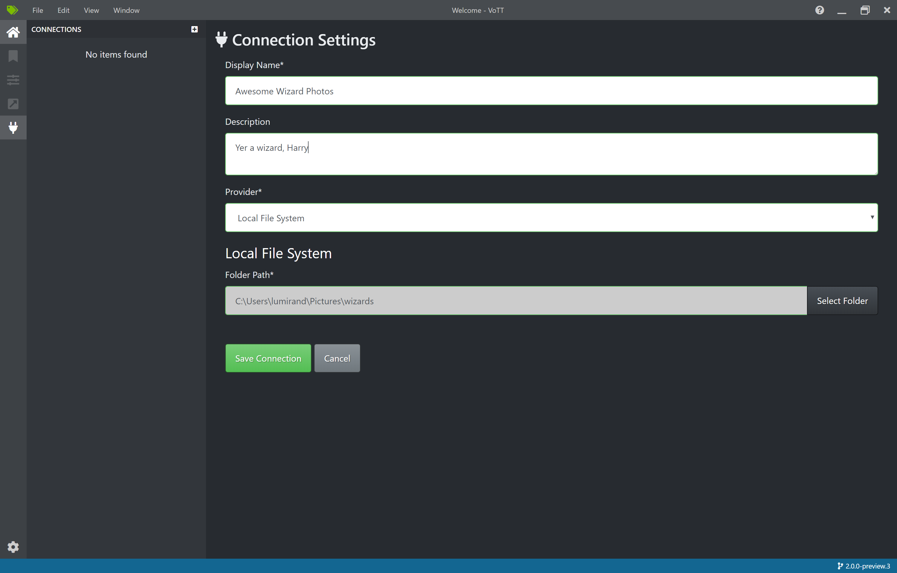
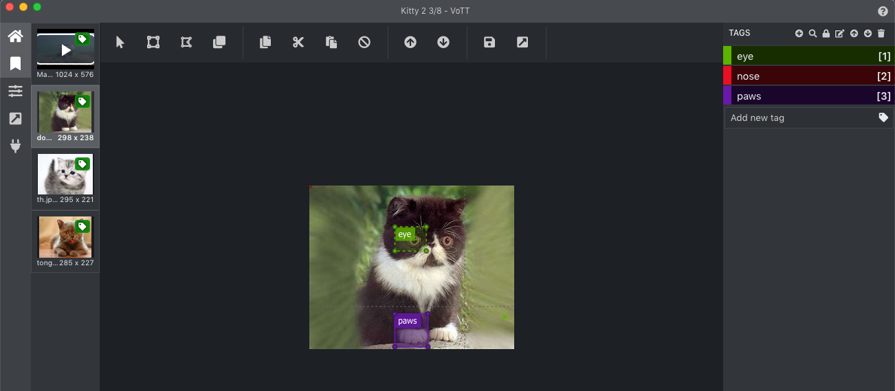
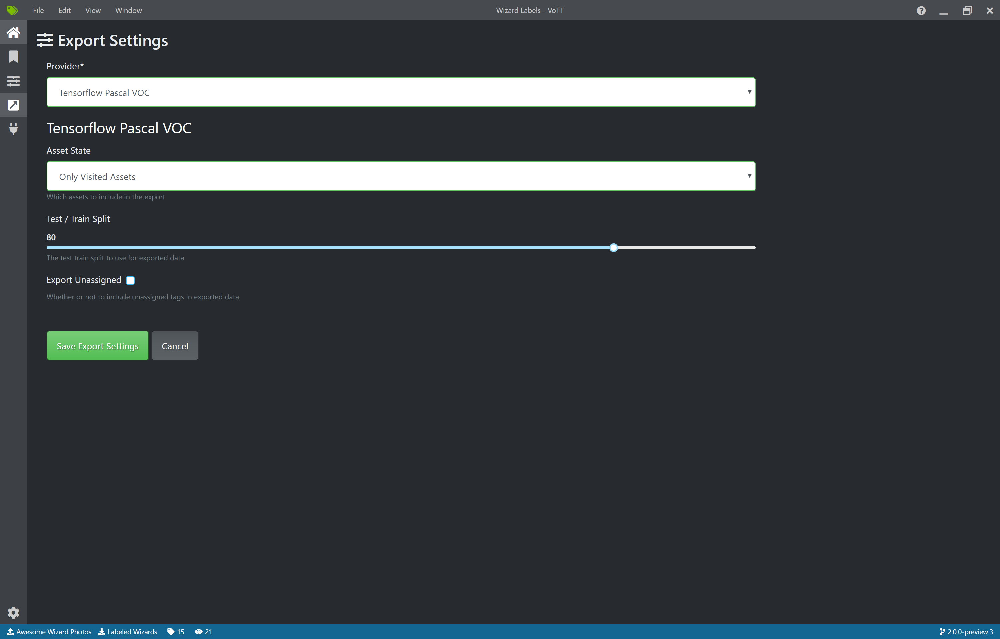

# VoTT (Visual Object Tagging Tool)

[](https://dev.azure.com/msft-vott/VoTT/_build/latest?definitionId=6?branchName=v2) [](https://codecov.io/gh/Microsoft/VoTT)

[Current Complexity Analysis Report](https://microsoft.github.io/VoTT/)

## **NOTE:** this is a Preview release of VoTT. Features may be incomplete or behave incorrectly (bugs! 🐞). [Feedback is appreciated!](https://github.com/Microsoft/VoTT/issues)
----------

An open source annotation and labeling tool for image and video assets.

VoTT is a React + Redux Web application, written in [TypeScript](https://github.com/Microsoft/TypeScript). This project was bootstrapped with [Create React App](https://github.com/facebook/create-react-app).

Features include:

* The ability to label images or video frames
* Extensible model for importing data from local or cloud storage providers
* Extensible model for exporting labeled data to local or cloud storage providers

VoTT helps facilitate an end-to-end machine learning pipeline:


## Table of Contents
<!-- generated using: https://www.npmjs.com/package/markdown-toc-->
<!-- command: `markdown-toc -i README.md`-->

<!-- toc -->

- [Getting Started](#getting-started)
  * [Running VoTT](#running-vott)
    + [Download and install a release package for your platform (recommended)](#download-and-install-a-release-package-for-your-platform-recommended)
    + [Build and run from source](#build-and-run-from-source)
- [V1 & V2](#v1--v2)
  * [Where is V1?](#where-is-v1)
- [Using VoTT](#using-vott)
  * [Creating Connections](#creating-connections)
  * [Creating a New Project](#creating-a-new-project)
    + [Project Settings](#project-settings)
      - [Security Tokens](#security-tokens)
  * [Labeling an Image](#labeling-an-image)
  * [Labeling a Video](#labeling-a-video)
  * [Exporting Labels](#exporting-labels)
- [Collaborators](#collaborators)
- [Contributing to VoTT](#contributing-to-vott)

<!-- tocstop -->

# Getting Started

## Running VoTT

VoTT can be installed as as native application or run from source.

### Download and install a release package for your platform (recommended)

VoTT is available for Windows, Linux and OSX. Download the appropriate platform package/installer from [GitHub Releases](https://github.com/Microsoft/VoTT/releases). `v2` releases will be prefixed by `2.x`.

### Build and run from source

VoTT requires [NodeJS (>= 10.x, Dubnium) and NPM](https://github.com/nodejs/Release)

   ```bash
    git clone https://github.com/Microsoft/VoTT.git
    cd VoTT
    git checkout v2
    npm install
    npm start
   ```
   **Important:** When running locally with `npm`, both the electron and the browser versions of the application will start. One major difference is that electron can access the local file system.

# V1 & V2

VoTT V2 is a refactor and refresh of the original Electron-based application. As the usage and demand for VoTT grew, V2 was started as an initiative to improve and make VoTT more extensible and maintainable. In addition, V2 uses more modern development frameworks and patterns (React, Redux) and is authored in TypeScript.

A number of code quality practices have been adopted, including:

* Code Linting
* Unit tests & mocks (Jest, Enzyme)
* [Code coverage](https://codecov.io/gh/Microsoft/VoTT) ([CodeCov.io](https://codecov.io/))
* [Complexity analysis](https://microsoft.github.io/VoTT/) ([Plato](docs/PLATO.md))

All V2 efforts are on the [v2](https://github.com/Microsoft/VoTT/tree/v2) branch. The git history for V1 and V2 have significantly diverged; when V2 is complete, master will be updated to reflect V2.

## Where is V1?

Master still reflects The V1 codebase - any fixes or updates can still be made there.  Likewise, all 1.x releases can still be found under [GitHub Releases](https://github.com/Microsoft/VoTT/releases).

# Using VoTT

## Creating Connections

VoTT is a 'Bring Your Own Data' (BYOD) application. In VoTT, connections are used to configure and manage source (assets to labeled) and target (where labels should be exported to) data sources.

Connections can be setup and shared across projects. Connections have been designed using an extensible provider model -- new source/target provides can easily be added.  Currently, VOTT supports:

* Azure Blob Storage
* [Bing Image Search](https://azure.microsoft.com/en-us/services/cognitive-services/bing-image-search-api/)
* Local File System

To create a new connection, click the 'New Connection' icon, in the left hand navigation bar:



## Creating a New Project

Labeling workflows in VoTT revolve around projects - a collection of configuration and settings that are persisted. Projects define a source and target connection, as well as project metadata - including tags to be used when labeling source assests.

As mentioned above, all projects require a source and target connection:

* **Source Connection** - Where to pull assests from
* **Target Connection** - Where project files and exported data are stored


### Project Settings

Project settings can be modified after a project has been created, by clicking on the 'Project Setting' icon in the left hand navigation bar.

#### Security Tokens

Some project settings can include sensitive values, such as API keys or other shared secrets. Each project has will generate a security token that can be used to encrypt/decrypt sensitive project settings.

Security tokens can be found under 'Application Settings' by clicking the gear icon in the lower corner of the left hand navigation bar.

**NOTE:** Project files can be shared among multiple people. In order to share sensitive project settings, *all parties must have/use the same security token.*

The token name and key *must* match in order for sensitive values to successfully be decrypted.


## Labeling an Image

When a project is created or opened, the main tag editor window opens. The tag editor consists of of two main parts:

* A preview pane that contains a scrollable list of images and videos, from the source target
* The main editor tool that allows tags to be applied to drawn regions

Selecting an image/video on the left will load that image in the main tag editor. Regions can then be drawn on the loaded asset and a tag can be applied.

As desired, repeat this process for any additional assets.



## Labeling a Video

Coming soon!

## Exporting Labels

Once assets have been labeled, they can be exported into a variety of formats:

* [Azure Custom Vision Service](https://azure.microsoft.com/en-us/services/cognitive-services/custom-vision-service/)
* TensorFlow (Pascal VOC and TFRecords)
* VoTT (generic JSON schema)

In addition, all assets can be exported or only visisted/tagged assets can be exported.  Click on the 'Export' icon in the left hand navigation. Select the appropriate export provider and which assets to export.




# Collaborators

VoTT was originally developed by the [Commercial Software Engineering (CSE) group at Microsoft](https://www.microsoft.com/developerblog/), in Israel.

# Contributing to VoTT

There are many ways to contribute to VoTT -- please review our [contribution guidelines](CONTRIBUTING.md).

This project has adopted the [Microsoft Open Source Code of Conduct](https://opensource.microsoft.com/codeofconduct/). For more information see
the [Code of Conduct FAQ](https://opensource.microsoft.com/codeofconduct/faq/) or contact [opencode@microsoft.com](mailto:opencode@microsoft.com)
with any additional questions or comments.
