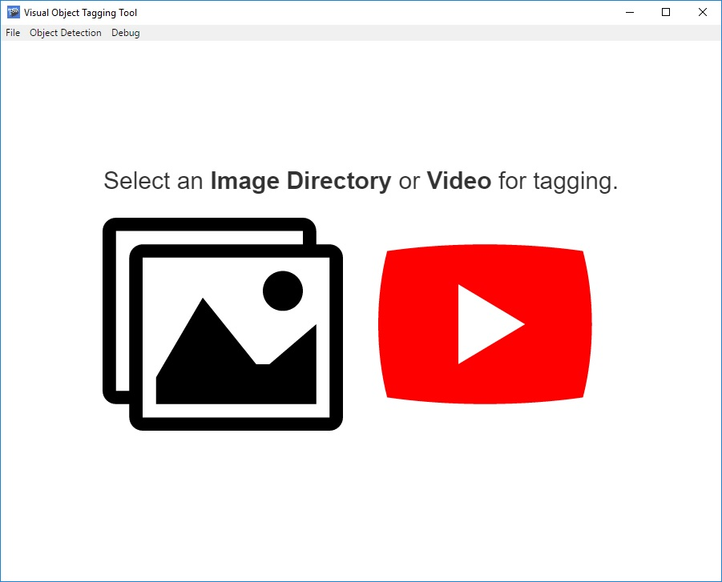
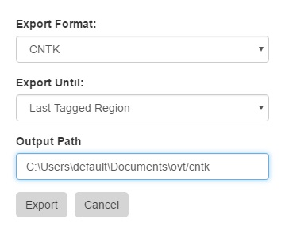
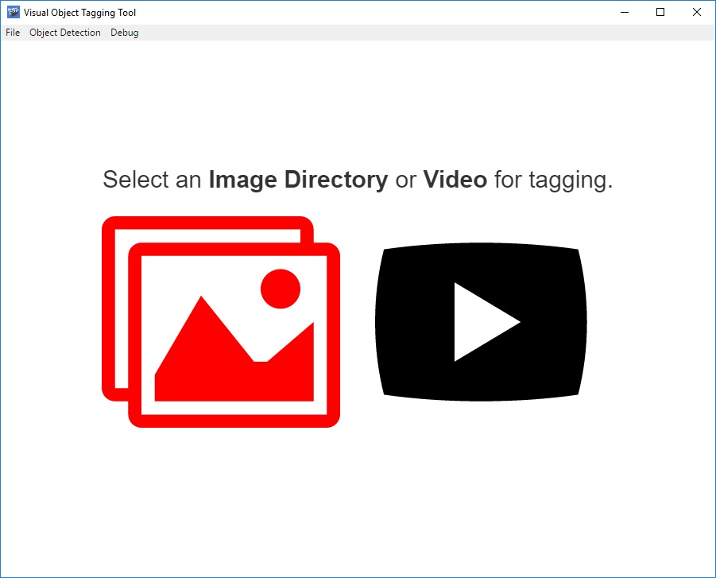
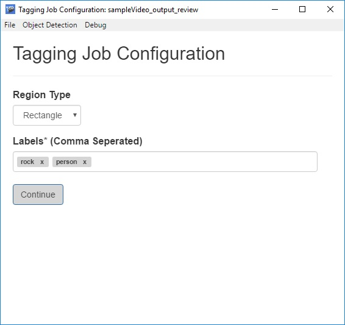
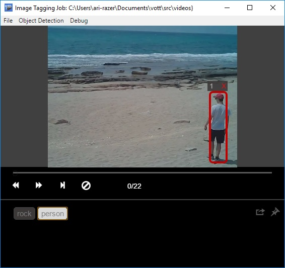
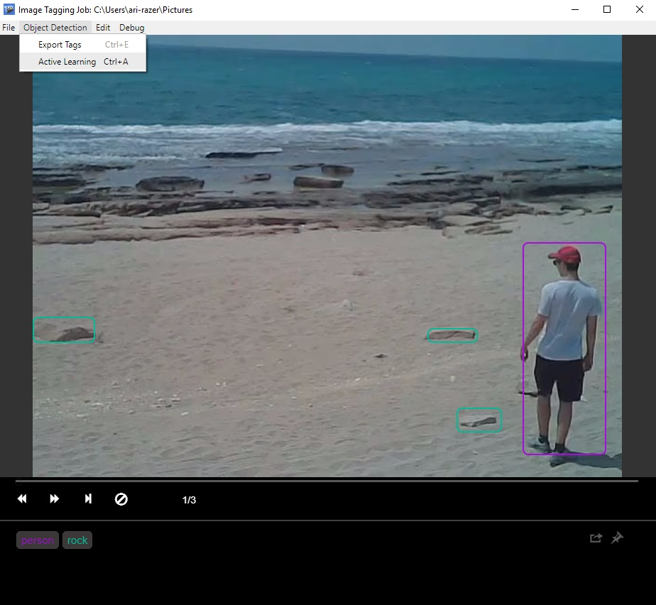
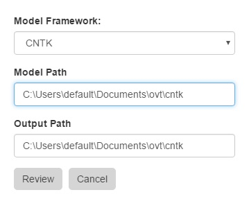

# VoTT: Visual Object Tagging Tool 1.5 

This tool provides end to end support for generating datasets and validating object detection models from video and image assets.

### End to End Object Detection Pipeline:


The tool supports the following **features**:

- The ability to tag and annotate Image Directories or Stand alone videos.
- Computer-assisted tagging and tracking of objects in videos using the [Camshift tracking algorithm](http://opencv.jp/opencv-1.0.0_org/docs/papers/camshift.pdf).

- Exporting tags and assets to CNTK, Tensorflow (PascalVOC) or YOLO format for training an object detection model.
- Running and validating a trained CNTK object detection model on new videos to generate stronger models.

- Exporting tags and assets to Custom Vision Service CNTK, Tensorflow (PascalVOC) or YOLO format for training an object detection model.
- Use Active Learning with trained object detection models (locally or remotely) on new videos to generate stronger models.


## Table of Contents

 - [Installation](#installation)
 - [Tagging a Video](#tagging-a-video)
 - [Tagging an Image Directory](#tagging-an-image-directory)
 - [Reviewing and Improving an Object Detection Model](#reviewing-and-improving-an-object-detection-model)
 - [Upcoming Features](#upcoming-features)
 - [How to Contribute](#how-to-contribute)

---
## Installation

### Installing the Visual Object Tagging Tool Binary

 1. Download and extract the app [release package](https://github.com/CatalystCode/CNTK-Object-Detection-Video-Tagging-Tool/releases)

 2. Run the app by launching the `VOTT` executable which will be located inside the unzipped folder.

 ### Installing the Visual Object Tagging Tool npm

 1. Clone this directory 

 2. Install Node.js

 3. Run the following command in the terminal.
    ```
        npm install
        npm start
    ```

 ### Installing CNTK with the FRCNN Prerequisites for Reviewing Model

*Please note that installation of **CNTK and FASTER-RCNN dependencies** are **optional for tagging** and are **only required for CNTK model review and training**.*

1. Install [CNTK](https://github.com/Microsoft/CNTK/wiki/Setup-CNTK-on-your-machine) (*Note: currently the tool only supports the full installation method (non pip) of CNTK*).

2. Follow the setup instructions of the [CNTK Faster-RCNN tutorial](https://docs.microsoft.com/en-us/cognitive-toolkit/object-detection-using-faster-r-cnn#setup) (*Note: Faster-RCNN currently only supports Linux python version 3.4 and not 3.5*).

3. Configure `CNTK-Config.json` (which resides in the `\resources\app` directory of the tagging tool) with the following properties to enable the model review feature:

```json
{
    "cntkPath" : "{CNTK Path default is c:/local/cntk}",
}
```
## Tagging a Video

 1. Select the option to tag a video

    

 2. Load an MP4 video file either by dragging it into the app or clicking on and selecting it.

    

 3. Configure the tagging job and specify the settings in the screenshot below:

    

    **Frame Extraction Rate**: number of frames to tag per second of video<br>

    **Tagging Region Type**: type of bounding box for tagging regions<br>
      - *Rectangle*: tag bounding boxes of any dimension
      - *Square*: tag bounding boxes of auto-fixed dimensions

    **Suggested Region Method**: how to suggest regions for next frame<br>
     - *Tracking*: Use camshift to track tagged regions in next frame
     - *Copy Last Frame*: Copy all regions to the next frame

    **Enable Scene Change Detection**: Detect scene changes to prevent false positives when tracking. (Note: this option is slightly slower)

    **Labels**: labels of the tagged regions (e.g. `Cat`, `Dog`, `Horse`, `Person`)<br>

 4. Tag the video frame by frame
 
    

    **Tagging**: click and drag a bounding box around the desired area, then move or resize the region until it fits the object

    **Navigation**: users can navigate between video frames by using the  buttons, the left/right arrow keys, or the video skip bar
     - Tags are auto-saved each time a frame is changed

    **Tracking**: new regions are tracked by default until a given scene changes.
     - Since the [camshift algorithm](http://opencv.jp/opencv-1.0.0_org/docs/papers/camshift.pdf) has some known limitations, you can disable tracking for certain sets of frames. To toggle tracking *on* and *off* use the file menu setting, or the keyboard shortcut Ctrl/Cmd + T.


 5. Export video Tags using the `Object Detection` Menu or Ctrl/Cmd + E

    
    
    *Note on exporting: the tool reserves a random 20% sample of the tagged frames as a test set.*
 
    Specify the following export configuration settings:
    
    
    
    - **Export Format**: What framework to export to defaults to *CNTK*<br>
    - **Export Frames Until**: how far into the video the export operation will proceed<br>
      - *Last Tagged Region*: exports frames up until the last frame containing tags
      - *Last Visited Frame*: exports frames up until the last frame that the user explicitly visited
      - *Last Frame*: exports all video frames<br>
    - **Training Path/Key**: directory path for exporting training data or the custom vision service training key<br>
    
---

## Tagging an Image Directory

 1. Select the option to tag an image directory

    

 2. Load an image directory by selecting it.

    

 3. Configure the tagging job and specify the settings in the screenshot below:

    

    **Tagging Region Type**:  type of bounding box for tagging regions<br>
      - *Rectangle*: tag bounding boxes of any dimension
      - *Square*: tag bounding boxes of auto-fixed dimensions

    **Labels**: labels of the tagged regions (e.g. `Cat`, `Dog`, `Horse`, `Person`)<br>

 4. Tag each Image
 
    

    **Tagging**: click and drag a bounding box around the desired area, then move or resize the region until it fits the object
     - Selected regions appear as red  and unselected regions will appear as blue .
     - Assign a tag to a region by clicking on it and selecting the desired tag from the labeling toolbar at the bottom of the tagging control
     - Click the  button to clear all tags on a given frame

    **Navigation**: users can navigate between video frames by using the  buttons, the left/right arrow keys, or the video skip bar
     - Tags are auto-saved each time a frame is changed

 5. Export Image directory Tags using the Object Detection Menu or Ctrl/Cmd + E

    
    
    *Note on exporting: the tool reserves a random 20% sample of the tagged frames as a test set.*
 
    Specify the following export configuration settings:
    
    
    
    - **Export Format**: What framework to export to defaults to *CNTK*<br>
    - **Export Frames Until**: how far into the video the export operation will proceed<br>
      - *Last Tagged Region*: exports frames up until the last frame containing tags
      - *Last Visited Frame*: exports frames up until the last frame that the user explicitly visited
      - *Last Frame*: exports all video frames<br>
    - **Output directory**: directory path for exporting training data<br>
    
---
## Active Learning and Improving an Object Detection Model

There are two options to run a model for active learning within VoTT one is to use the local reviewer interface and the other is to provide an endpoint. Providing an endpoint reduces the amount of manual configuration work necessary to get your model running so this is the prefered method but for certain scenarios using the interface might still be relevant. Below is an example of both scenarios. 

### Remote Active learning using Docker 

1. Set up your own remote model endpoint locally or on Azure with Docker [CNTK Example](https://github.com/User1m/vott-reviewer-ext)
2. Paste the review service endpoint to review your model.

### Local Active Learning CNTK Example

 1. Train model with [Object Detection using FasterRCNN](https://docs.microsoft.com/en-us/cognitive-toolkit/object-detection-using-faster-r-cnn#run-faster-r-cnn-on-your-own-data)<br> 
 2. Since CNTK does not embed the names of the classes in the model, on default, the module returns non descriptive names for the classes, e.g. "class_1", "class_2". To resolve this copy the `class_map.txt` file generated by the FASTER-RCNN tutorial to the same directory that contains your model.   

 3. Load a new asset that the model has not been trained on
 4. Configure a new or load a previous tagging job 
 4. Apply model to new asset using Ctrl/Cmd + R
 5. Specify a model path and temporary output directory<br> 
    
 6. When the model finishes processing, validate tags, re-export and retrain it
 7. Repeat step 1 on new assets until the model performance is satisfactory
 
 
## Supporting additional object detection Export and Review formats.

In the latest release we provide support for [Export and Review formats](https://github.com/CatalystCode/VOTT/tree/master/src/lib/detection_algorithms). To add a new object detection format, copy the interface folder and use the Yolo and CNTK implementations as reference. 

## Keyboard Shortcuts

- Open Video: Ctrl + O
- Open Image Directory: Ctrl + I
- Save Tags: Ctrl + S
- Toggle Play/Pause: Space
- Toggle Tracking: Ctrl + T
- Toggle Exclusive Add Mode: Crtl + N *(For adding smaller regions inside of a large region)*
- Export Tags: Ctrl + E
- Active Learning: Ctrl + L
- Duplicate last frame regions: D
- Delete Frame: Shift + Del
- Open Developer Console: Ctrl + D
- Refresh App: Ctrl + Space
- Show Help: Ctrl + H
- Select All: Ctrl + (A or 1 on number pad)
- Cut: Ctrl + X
- Copy: Ctrl + C
- Paste: Ctrl + V

## Mouse Controls

- **Two-point mode:** Hold down Ctrl while creating a region
- **Square mode:** Hold down Shift while creating a region
- **Multi-select:** Hold down Shift while selecting regions
- **Exclusive Tracking mode:** Ctrl + N to block frame UI allowing a user to create a region on top of existing regions

## Region Manipulation with Arrow Keys

VOTT allows you to fine tune the bounding boxes using the arrow keys in a few different ways. While a region is selected:

- **Move region:** Hold Ctrl + Direction
- **Shrink region:** Hold Ctrl + Alt + Direction
- **Expand region:** Hold Ctrl + Shift + Direction

## Tagging Controls

Use the number keys to quickly tag a selected region *(Only works for single digits 0-9)*

## Upcoming Features

- Tagging project management.
- Alternative Tracking algorithms such as optical flow.
- Classification Labeling Support.
- Segmentation Annotation support.
- Zoom in and out

---

## How to Contribute

You are welcome to send us any bugs you may find, suggestions, or any other comments.

Before sending anything, please go over the repository issues list, just to make sure that it isn't already there.

You are more than welcome to fork this repository and send us a pull request if you feel that what you've done should be included.
