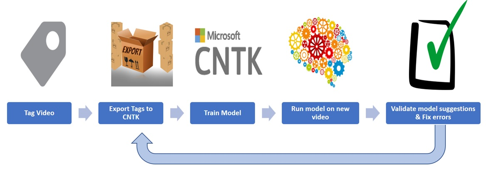
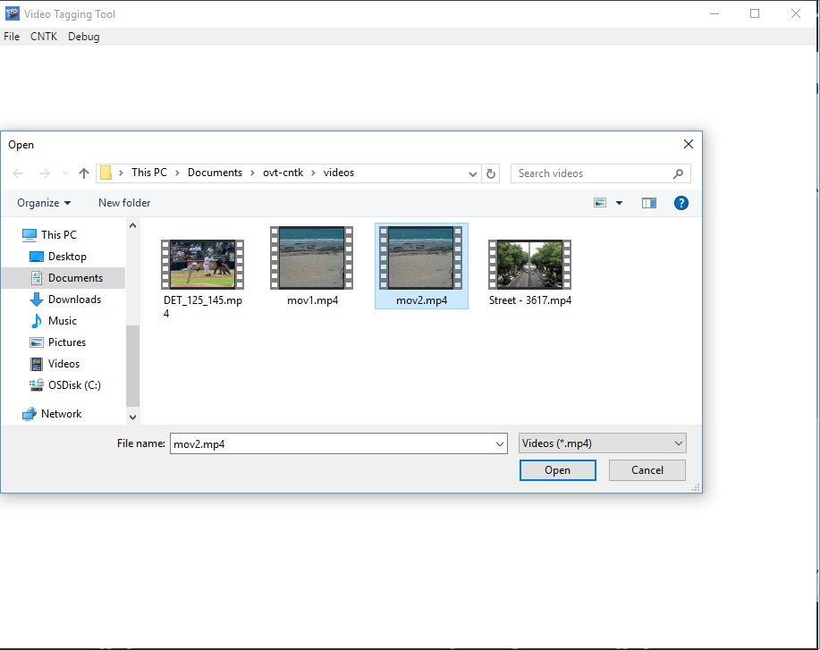
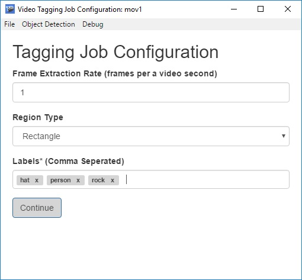
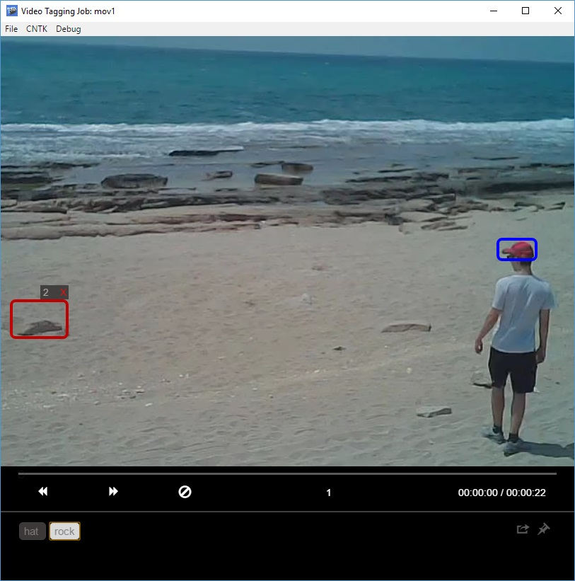
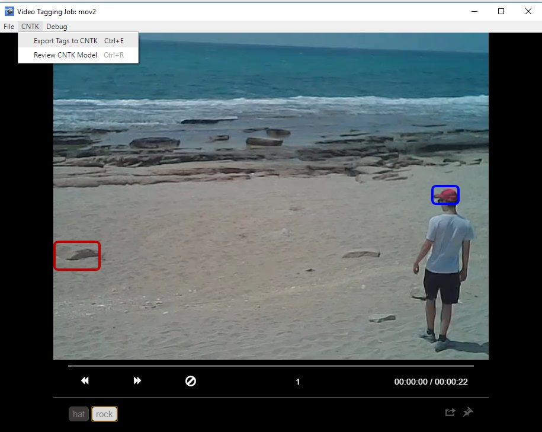

# CNTK Video Tagging Tool for Object Detection

This tool provides end to end support for generating datasets and validating object detection models.

### End to End Object Detection Pipeline:


The tool supports the following **features**:

- Computer-assisted tagging and tracking of objects in videos using the [Camshift tracking algorithm](http://opencv.jp/opencv-1.0.0_org/docs/papers/camshift.pdf).
- Exporting tags and assets to CNTK format for training a CNTK object detection model.
- Running and validating a trained CNTK object detection model on new videos to generate stronger models.

## Table of Contents

 - [Installation](#installation)
 - [Tagging a Video](#tagging-a-video)
 - [Reviewing and Improving a CNTK Object Detection Model](#how-to-review-and-improve-a-CNTK-Object-Detection-Model)
 - [Upcoming Features](#upcoming-features)
 - [How to Contribute](#how-to-contribute)

---
## Installation

### Installing the Video Tagging Tool

 1. Download and extract the app [release package](https://github.com/CatalystCode/CNTK-Object-Detection-Video-Tagging-Tool/releases)

 2. Run the app by launching the "CNTKVideoTagger" executable which will be located inside the unzipped folder.

 ### Installing CNTK with the FRCNN Prerequisites

*Please note that installation of **CNTK and FAST-RCNN dependencies** are **optional for tagging** and are **only required for CNTK model review and training**.*

1. Install [CNTK](https://github.com/Microsoft/CNTK/wiki/Setup-CNTK-on-your-machine) (*Note: currently the tool only supports the full installation method (non pip) of CNTK*).

2. Follow the setup instructions of the [CNTK Fast-RCNN tutorial](https://github.com/Microsoft/CNTK/wiki/Object-Detection-using-Fast-R-CNN#setup) (*Note: Fast-RCNN currently only supports Linux python version 3.4 and not 3.5*).

3. Configure `CNTK-Config.json` (which resides in the '\resources\app' directory of the tagging tool) with the following properties to enable the model review feature:

```json
{
    "cntkPath" : "{CNTK Path default is c:/local/cntk}",
}
```
## Tagging a Video

 1. Load an MP4 video file either by dragging it into the app or clicking on and selecting it.

  

 2. Configure the tagging job and specify the settings in the screenshot below:

    

    **Frame Extraction Rate**: number of frames to tag per second of video<br>

    **Tagging Region Type**:  type of bounding box for tagging regions<br>
      - *Rectangle*: tag bounding boxes of any dimension
      - *Square*: tag bounding boxes of auto-fixed dimensions

    **Export Frames Until**: how far into the video the export operation will proceed<br>
      - *Last Tagged Region*: exports frames up until the last frame containing tags
      - *Last Visited Frame*: exports frames up until the last frame that the user explicitly visited
      - *Last Frame*: exports all video frames

    **Output directory**: directory path for exporting training data<br>

    **Model Path**: file path of the trained Fast-RCNN model file (optional)<br>

    **Labels**: labels of the tagged regions (e.g. `Cat`, `Dog`, `Horse`, `Person`)<br>

 3. Tag the video frame by frame
 
    

    **Tagging**: click and drag a bounding box around the desired area, then move or resize the region until it fits the object
     - Selected regions appear as red  and unselected regions will appear as blue .
     - Assign a tag to a region by clicking on it and selecting the desired tag from the labeling toolbar at the bottom of the tagging control
     - Click the  button to clear all tags on a given frame

    **Navigation**: users can navigate between video frames by using the  buttons, the left/right arrow keys, or the video skip bar
     - Tags are auto-saved each time a frame is changed

    **Tracking**: new regions are tracked by default until a given scene changes.
     - Since the [camshift algorithm](http://opencv.jp/opencv-1.0.0_org/docs/papers/camshift.pdf) has some known limitations, you can disable tracking for certain sets of frames. To toggle tracking *on* and *off* use the file menu setting, or the keyboard shortcut Ctrl/Cmd + T.


 4. Export video to CNTK Format using Menu or Ctrl/Cmd + E

    *Note on exporting: the tool reserves a random 20% sample of the tagged frames as a test set.*

    


---
## How to Review and Improve a CNTK Object Detection Model

 1. Train model with [Object Detection using FastRCNN](https://github.com/Microsoft/CNTK/wiki/Object-Detection-using-Fast-R-CNN#train-on-your-own-data)<br> *Note: the data is already in CNTK format, so you do not have to run `C1_DrawBboxesOnImages.py` or `C2_AssignLabelsToBboxes.py`*
 2. Load a new video that the model has not been trained on
 3. Configure the tagging job specifying the following preferences
 4. Apply model to new video using Ctrl/Cmd + R
 5. When the model finishes processing, validate tags, re-export and retrain it
 6. Repeat step 1 on new videos until the model performance is satisfactory

<a name="upcoming"></a>

## Upcoming Features 

- Image directory tagging support
- Tagging project management

-----------
<a name="contribute"></a> 

## How to Contribute

You are welcome to send us any bugs you may find, suggestions, or any other comments.

Before sending anything, please go over the repository issues list, just to make sure that it isn't already there.

You are more than welcome to fork this repository and send us a pull request if you feel that what you've done should be included.
