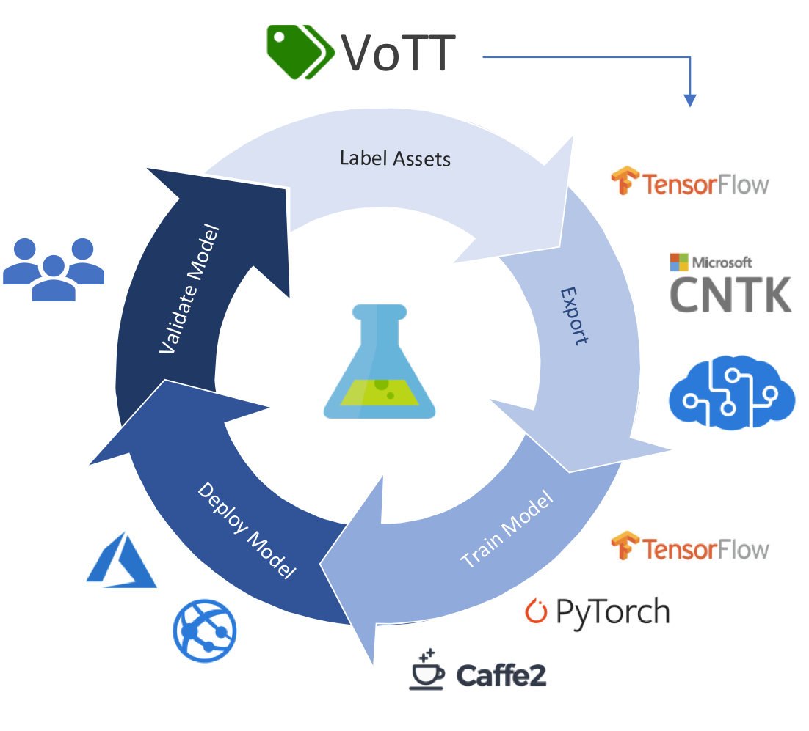
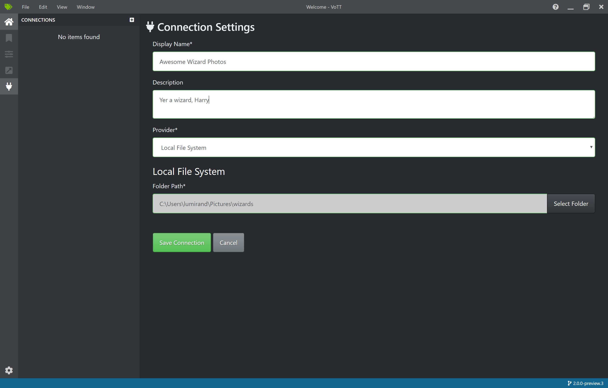
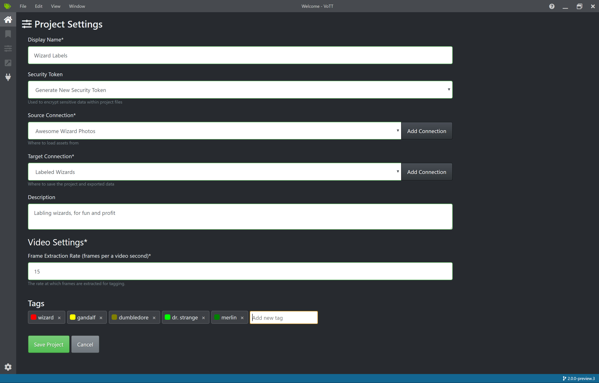
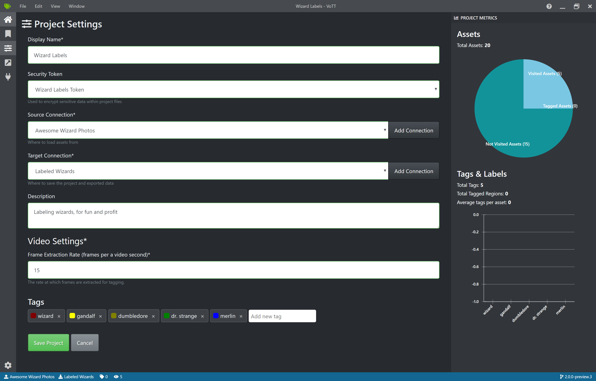
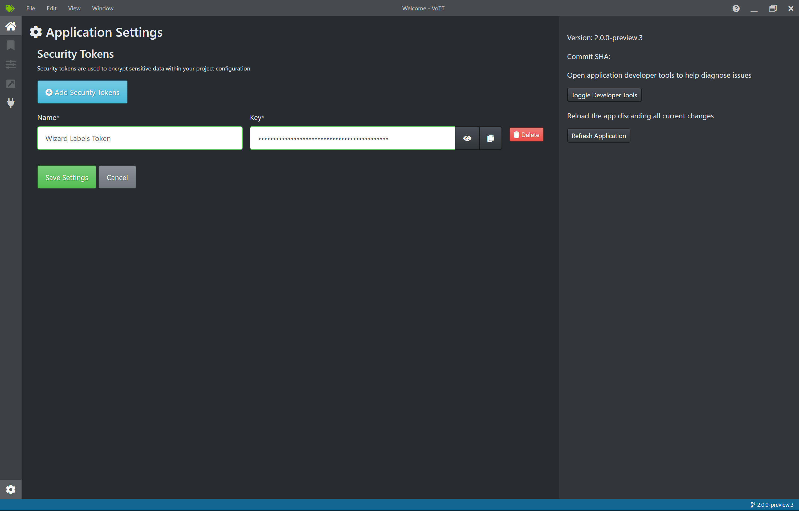
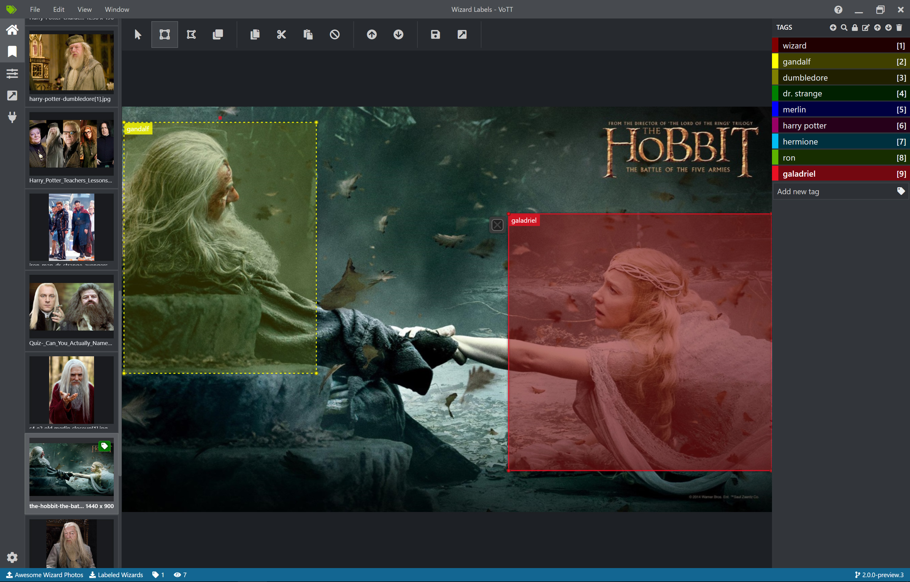
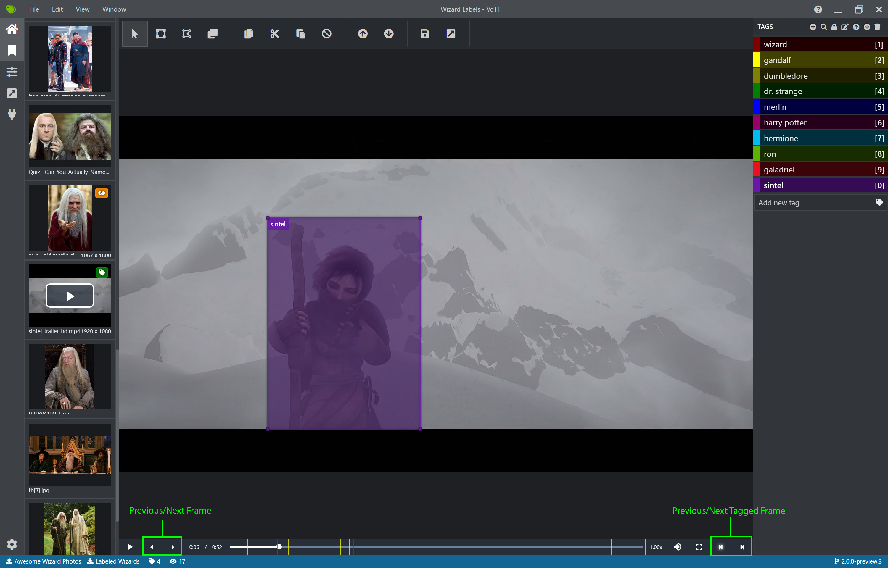
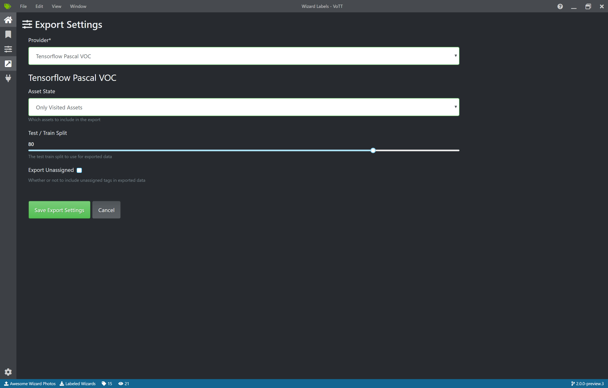
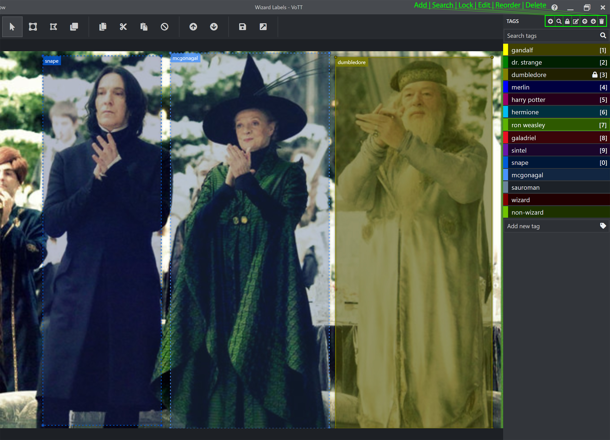

# VoTT (Visual Object Tagging Tool)

[](https://dev.azure.com/msft-vott/VoTT/_build/latest?definitionId=25&branchName=master)
[](https://codecov.io/gh/Microsoft/VoTT)
[](https://sonarcloud.io/dashboard?id=Microsoft_VoTT)

[Complexity Analysis Report](https://vottv2.z5.web.core.windows.net/)

----------

An open source annotation and labeling tool for image and video assets.

VoTT is a React + Redux Web application, written in [TypeScript](https://github.com/Microsoft/TypeScript). This project was bootstrapped with [Create React App](https://github.com/facebook/create-react-app).

Features include:

* The ability to label images or video frames
* Extensible model for importing data from local or cloud storage providers
* Extensible model for exporting labeled data to local or cloud storage providers

VoTT helps facilitate an end-to-end machine learning pipeline:



## Table of Contents
<!-- generated using: https://www.npmjs.com/package/markdown-toc-->
<!-- command: `markdown-toc -i README.md --bullets "*"`-->

<!-- toc -->


- [VoTT (Visual Object Tagging Tool)](#vott-visual-object-tagging-tool)
  - [Table of Contents](#table-of-contents)
  - [Getting Started](#getting-started)
    - [Download and install a release package for your platform (recommended)](#download-and-install-a-release-package-for-your-platform-recommended)
    - [Build and run from source](#build-and-run-from-source)
    - [Run as Web Application](#run-as-web-application)
  - [V1 & V2](#v1--v2)
    - [Where is V1](#where-is-v1)
      - [V1 releases](#v1-releases)
    - [V1 projects in V2](#v1-projects-in-v2)
  - [Using VoTT](#using-vott)
    - [Creating Connections](#creating-connections)
    - [Creating a New Project](#creating-a-new-project)
      - [Project Settings](#project-settings)
      - [Security Tokens](#security-tokens)
    - [Labeling an Image](#labeling-an-image)
    - [Labeling a Video](#labeling-a-video)
    - [Exporting Labels](#exporting-labels)
    - [Keyboard Shortcuts](#keyboard-shortcuts)
      - [Tag Ordering](#tag-ordering)
      - [Tag Locking](#tag-locking)
      - [Editor Shortcuts](#editor-shortcuts)
      - [Mouse Controls](#mouse-controls)
  - [Collaborators](#collaborators)
  - [Contributing to VoTT](#contributing-to-vott)

<!-- tocstop -->

## Getting Started

VoTT can be installed as a native application or run from source. VoTT is also available as a [stand-alone Web application](https://vott.z22.web.core.windows.net) and can be used in any modern Web browser.

### Download and install a release package for your platform (recommended)

VoTT is available for Windows, Linux and OSX. Download the appropriate platform package/installer from [GitHub Releases](https://github.com/Microsoft/VoTT/releases). `v2` releases will be prefixed by `2.x`.

### Build and run from source

VoTT requires [NodeJS (>= 10.x, Dubnium) and NPM](https://github.com/nodejs/Release)

   ```bash
    git clone https://github.com/Microsoft/VoTT.git
    cd VoTT
    npm ci
    npm start
   ```
   > **IMPORTANT**
   >
   > When running locally with `npm`, both the electron and the browser versions of the application will start. One major difference is that the electron version can access the local file system.

### Run as Web Application

Using a modern Web browser, VoTT can be loaded from: [https://vott.z22.web.core.windows.net](https://vott.z22.web.core.windows.net)

As noted above, the Web version of VoTT *cannot* access the local file system; all assets must be imported/exported through a Cloud project.

## V1 & V2

VoTT V2 is a refactor and refresh of the original Electron-based application. As the usage and demand for VoTT grew, `V2` was started as an initiative to improve and make VoTT more extensible and maintainable. In addition, `V2` uses more modern development frameworks and patterns (React, Redux) and is authored in TypeScript.

A number of code quality practices have been adopted, including:

* Code Linting
* Unit tests & mocks (Jest, Enzyme)
* [Code coverage](https://codecov.io/gh/Microsoft/VoTT) ([CodeCov.io](https://codecov.io/))
* [Complexity analysis](https://vottv2.z5.web.core.windows.net/) ([Plato](docs/PLATO.md))

All `V2` efforts are on the [master](https://github.com/Microsoft/VoTT/tree/master) branch

### Where is V1

`V1` will be on the [v1](https://github.com/Microsoft/VoTT/tree/v1)  branch. There will not be any fixes or updates.

#### V1 releases

1.x releases can still be found under [GitHub Releases](https://github.com/Microsoft/VoTT/releases).

### V1 projects in V2

There is support for converting a V1 project into V2 format. Upon opening the JSON file, a window will pop up to confirm that the app should convert the project before redirecting to the editor screen. In this process, a `.vott` file will be generated in the same project directory, which may be used as the main project file going forward. We recommend backing up the V1 project file before converting the project.

## Using VoTT

### Creating Connections

VoTT is a 'Bring Your Own Data' (BYOD) application. In VoTT, connections are used to configure and manage source (the assets to label) and target (the location to which labels should be exported).

Connections can be set up and shared across projects. They use an extensible provider model, so new source/target providers can easily be added.

Currently, VoTT supports:

* [Azure Blob Storage](https://docs.microsoft.com/en-us/azure/storage/blobs/storage-blobs-introduction)
* [Bing Image Search](https://azure.microsoft.com/en-us/services/cognitive-services/bing-image-search-api/)
* Local File System

To create a new connection, click the `New Connections` (plug) icon, in the left hand navigation bar:



### Creating a New Project

Labeling workflows in VoTT revolve around projects - a collection of configurations and settings that persist.

Projects define source and target connections, and project metadata - including tags to be used when labeling source assets.

As mentioned above, all projects require a source and target connection:

* **Source Connection** - Where to pull assets from
* **Target Connection** - Where project files and exported data should be stored



#### Project Settings

Project settings can be modified after a project has been created, by clicking on the `Project Setting` (slider) icon in the left hand navigation bar. Project metrics, such as Visited Assets, Tagged Assets, and Average Tags Per Asset can also be viewed on this screen.



#### Security Tokens

Some project settings can include sensitive values, such as API keys or other shared secrets. Each project will generate a security token that can be used to encrypt/decrypt sensitive project settings.

Security tokens can be found in `Application Settings` by clicking the gear icon in the lower corner of the left hand navigation bar.

**NOTE:** Project files can be shared among multiple people. In order to share sensitive project settings, *all parties must have/use the same security token.*

The token name and key **must** match in order for sensitive values to be successfully decrypted.



### Labeling an Image

When a project is created or opened, the main tag editor window opens. The tag editor consists of three main parts:

* A resizeable preview pane that contains a scrollable list of images and videos, from the source connection
* The main editor pane that allows tags to be applied to drawn regions
* The tags editor pane that allows users to modify, lock, reorder, and delete tags

Selecting an image or video on the left will load that image in the main tag editor. Regions can then be drawn on the loaded asset and a tag can be applied.

As desired, repeat this process for any additional assets.



### Labeling a Video

Labeling a video is much like labeling a series of images. When a video is selected from the left, it will begin automatically playing, and there are several controls on the player, as seen here:



In addition to the normal video playback controls, there are two extra pairs of buttons.

On the left, there are the previous and next frame buttons. Clicking these will pause the video, and move to the next appropriate frame as determined by the project settings. For example, if the project settings have a frame extraction rate of 1, these buttons will cause the video to be moved back or forward 1 second, while if the frame extraction rate is 10, the video will be moved back or forward a tenth of a second.

On the right, there are the previous and next tagged frame buttons. Clicking these will pause the video and move to the next or previous frame that has a previously tagged region on it, if a tagged frame exists.

Colored lines will also be visible along the video's timeline. These indicate the video frames that have already been visited. A yellow line denotes a frame that has been visited only, while a green line denotes a frame that has been both visited and tagged. The colored lines can be clicked for quick navigation to the indicated frame.

The timeline can also be used to manually scrub through the video to an arbitrary point, though the project settings for frame extraction rate are always obeyed. Pausing the video will move to the closest frame according to this project setting. This way, a very low frame extraction rate, such as 1 frame per second, can be set for sections of the video known to contain few taggable items, and a much higher frame extraction rate, such as 30 frames per second, to allow fine-grained control.

Tagging and drawing regions is not possible while the video is playing.

### Exporting Labels

Once assets have been labeled, they can be exported into a variety of formats:

* [Azure Custom Vision Service](https://azure.microsoft.com/en-us/services/cognitive-services/custom-vision-service/)
* [Microsoft Cognitive Toolkit (CNTK)](https://github.com/Microsoft/CNTK)
* TensorFlow (Pascal VOC and TFRecords)
* VoTT (generic JSON schema)
* Comma Separated Values (CSV)

In addition, users may choose to export

* all assets
* only visited assets
* only tagged assets

Click on the `Export` (arrow) icon in the left hand navigation. Select the appropriate export provider and which assets to export. The percentage separated into testing and training sets can be adjusted here too.



### Keyboard Shortcuts

VoTT allows a number of keyboard shortcuts to make it easier to keep one hand on the mouse while tagging. It allows most common shortcuts:

* Ctrl or Cmd + C - copy
* Ctrl or Cmd + X - cut
* Ctrl or Cmd + V - paste
* Ctrl or Cmd + A - select all
* Ctrl or Cmd + Z - undo
* Ctrl or Cmd + Shift + Z - redo

#### Tag Ordering

Hotkeys of 1 through 0 are assigned to the first ten tags. These can be reordered by using the up/down arrow icons in in the tag editor pane.


#### Tag Locking

A tag can be locked for repeated tagging using the lock icon at the top of the tag editor pane. Tags can also be locked by combining Ctrl or Cmd and the tag hotkey, i.e. `Ctrl+2` would lock the second tag in the list.



#### Editor Shortcuts

In addition, the editor page has some special shortcuts to select tagging tools:

* V - Pointer/Select
* R - Draw Rectangle
* P - Draw Polygon
* Ctrl or Cmd + S - Save Project
* Ctrl or Cmd + E - Export Project

VOTT allows you to fine tune the bounding boxes using the arrow keys in a few different ways. While a region is selected:

* Ctrl + Arrowkey - Move Region
* Ctrl + Alt + Arrowkey - Shrink Region
* Ctrl + Shift + Arrowkey - Expand Region

The slide viewer can be navigated from the keyboard as follows:

* W or ArrowUp - Previous Asset
* S or ArrowDown - Next Asset

When the video playback bar is present, it allows the following shortcuts to select frames:

* A or ArrowLeft - Previous Frame
* D or ArrowRight - Next Frame
* Q - Previous Tagged Frame
* E - Next Tagged Frame

#### Mouse Controls

* Two-point mode - Hold down Ctrl while creating a region
* Square mode - Hold down Shift while creating a region
* Multi-select - Hold down Shift while selecting regions
* Exclusive Tracking mode - Ctrl + N to block frame UI allowing a user to create a region on top of existing regions


## Collaborators

VoTT was originally developed by the [Commercial Software Engineering (CSE) group at Microsoft](https://www.microsoft.com/developerblog/) in Israel.

V2 is developed by the CSE group at Microsoft in Redmond, Washington.

## Contributing to VoTT

There are many ways to contribute to VoTT -- please review our [contribution guidelines](CONTRIBUTING.md).

This project has adopted the [Microsoft Open Source Code of Conduct](https://opensource.microsoft.com/codeofconduct/). For more information see
the [Code of Conduct FAQ](https://opensource.microsoft.com/codeofconduct/faq/) or contact [opencode@microsoft.com](mailto:opencode@microsoft.com)
with any additional questions or comments.
